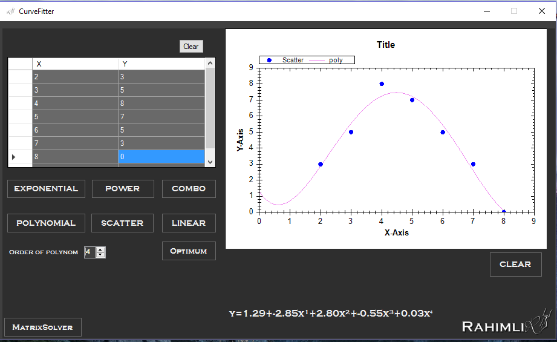
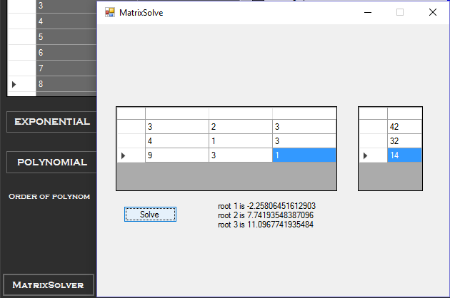

# Least Squares Regression using CSharp
Scientific Conference Desktop application
This is a special project developed for scientific conference held in Baku Higher Oil School ([University website](http://bhos.edu.az))
The project focuses on determining functional dependance between experimental data input and output. Using least squares regression methods the program written in C#, generates an optimal functional dependance.
# Program interface

You can see the input data region, where y is the function of x. After inputting the data, you can scatter (plot dots), and finally 
you can select the regression model to derive the best functional dependence. On the above picture you can see the polynomial of 4th order which describes some data. Notice that program also returns the function of a relationship. 

# MatrixSolver
During the development of project there was a need to build custom matrix solver functionality for finding the roots of NxN matrix. The size N is selectable. So in this program you can also find matrix solver. 

